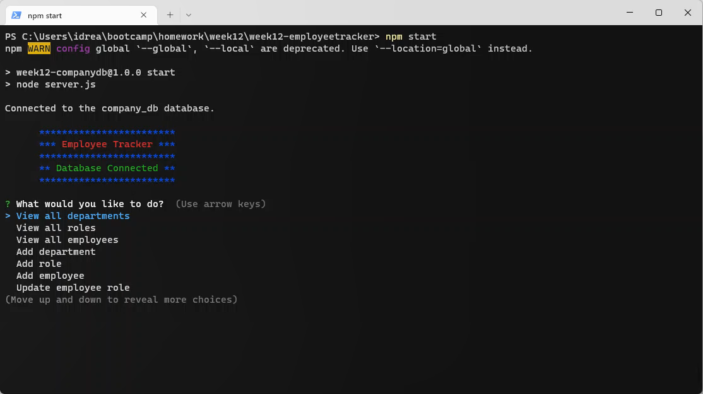
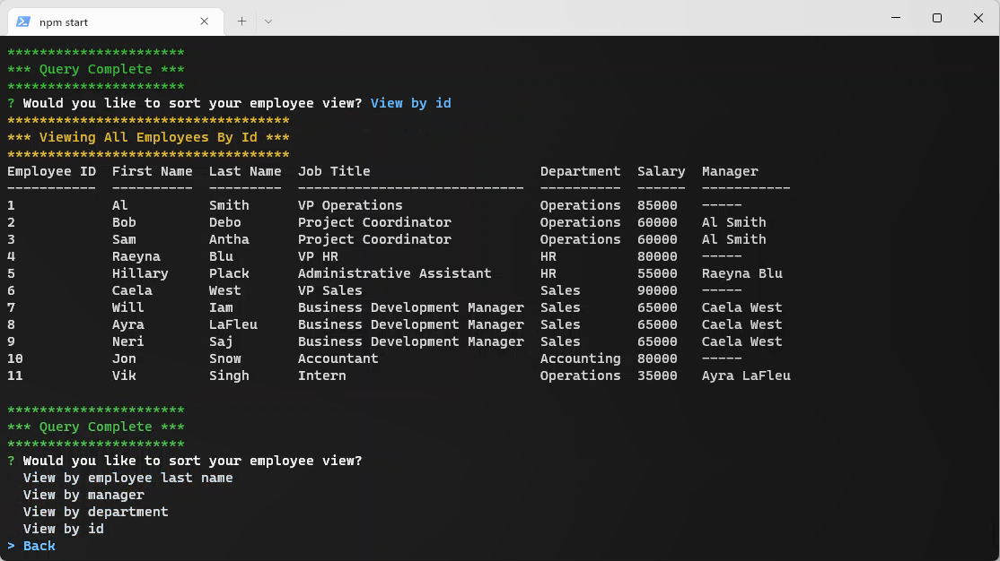

# SQL Challenge: Employee Tracker
  
  ## Description
  
  CLI app that was created to manage a company's employee database using Node.js, Inquirer and MySQL. See below for more details regarding the user requirements and specifications.

  ## User Story

  ```
  AS A business owner
  I WANT to be able to view and manage the departments, roles, and employees in my company
  SO THAT I can organize and plan my business
  ```


  ## Acceptance Criteria

  ```
GIVEN a command-line application that accepts user input
WHEN I start the application
THEN I am presented with the following options: view all departments, view all roles, view all employees, add a department, add a role, add an employee, and update an employee role
WHEN I choose to view all departments
THEN I am presented with a formatted table showing department names and department ids
WHEN I choose to view all roles
THEN I am presented with the job title, role id, the department that role belongs to, and the salary for that role
WHEN I choose to view all employees
THEN I am presented with a formatted table showing employee data, including employee ids, first names, last names, job titles, departments, salaries, and managers that the employees report to
WHEN I choose to add a department
THEN I am prompted to enter the name of the department and that department is added to the database
WHEN I choose to add a role
THEN I am prompted to enter the name, salary, and department for the role and that role is added to the database
WHEN I choose to add an employee
THEN I am prompted to enter the employee’s first name, last name, role, and manager, and that employee is added to the database
WHEN I choose to update an employee role
THEN I am prompted to select an employee to update and their new role and this information is updated in the database 
  ```
  
  ## Table of Contents 
  
  - [Installation](#installation)
  - [Usage](#usage)
  - [License](#license)
  - [Contributing](#contributing)
  - [Tests](#tests)
  - [Questions](#questions)
  
  ## [Installation](#table-of-contents)
  
  To install the application, download the git repository to your directory of choice and run the application by following the instructions below.
  
  ## [Usage](#table-of-contents)
  
  You’ll need to use the MySQL2 package to connect to your MySQL database and perform queries, the Inquirer package to interact with the user via the command line, and the console.table package to print MySQL rows to the console.

  Screenshots:

  

  

  Here's a link to the video: [Employee Tracker Video](https://drive.google.com/file/d/1MHfyaKHndVIhAu6nVxL2t9iown4cCzSz/view?usp=sharing)
  
  ## [License](#table-of-contents)

  License Used: N/A
 
  ## [Contributing](#table-of-contents)
  
  Not open for contributions.

  ## [Tests](#table-of-contents)
  
  N/A
  
  ## [Questions](#table-of-contents)
  
  For additional questions, please reach out to:

  [GitHub: devilarms83](https://github.com/devilarms83)

  [Email: bautista.albert@gmail.com](mailto:bautista.albert@gmail.com)

